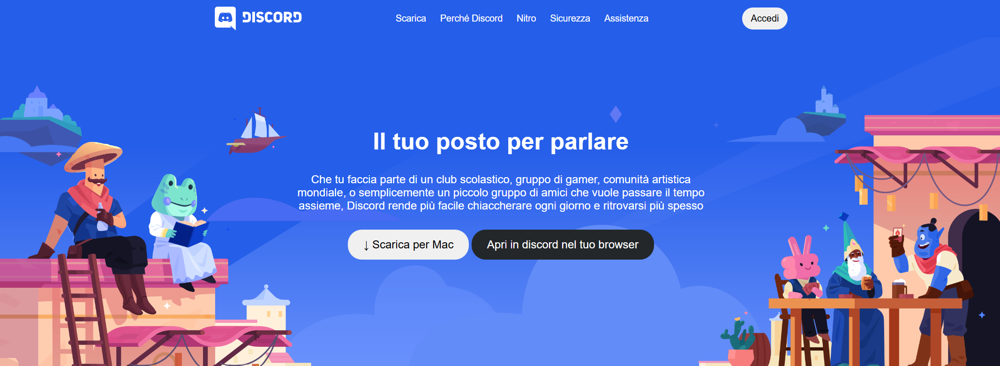
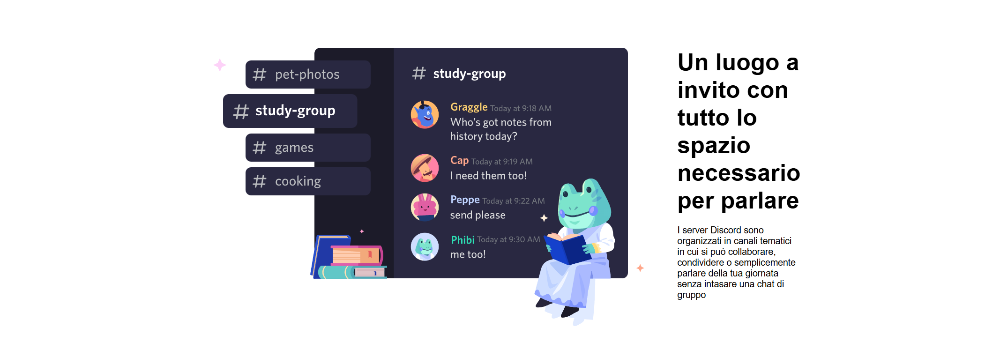
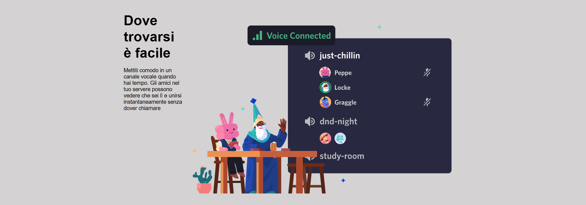
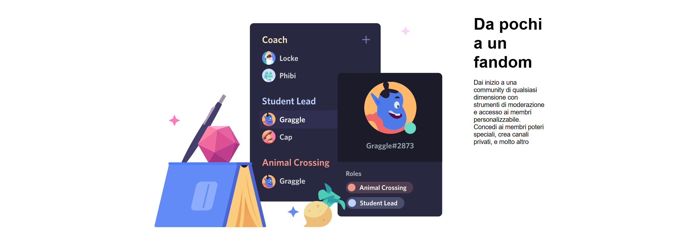
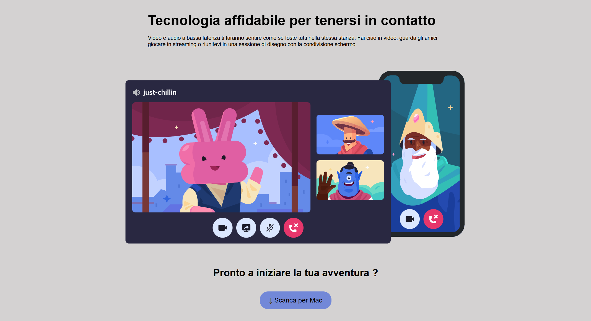
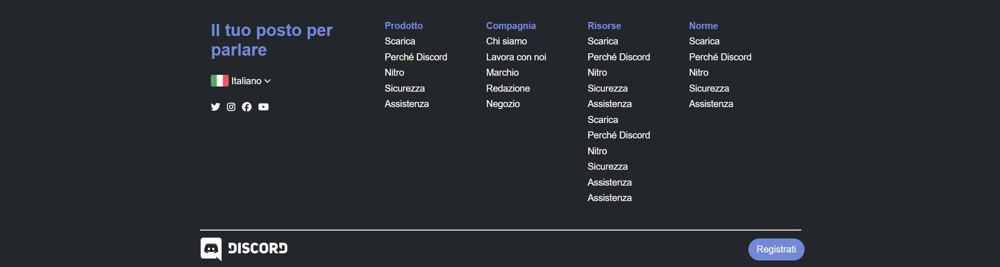

  

<h1 align="center">Pagina principale Discord</h1>

Pagina HTML/CSS che riproduce un layout ispirato alla pagina principale di Discord,
concentrandosi sulle sezioni viste a lezione (header, hero e sezioni centrali).

## Obiettivo

- Partire dalla struttura a blocchi realizzata nell’esercizio precedente sulla struttura di Discord
- Riprodurre il layout fornito nello screenshot, ispirato al sito Discord
- Procedere dai blocchi colorati ai dettagli grafici, lavorando una sezione alla volta:
  - header con logo, menu e pulsanti
  - sezioni centrali con testi e immagini
  - parte finale della pagina (se prevista nello screenshot)

## Approccio e buone pratiche

- Creare classi riutilizzabili individuando gli elementi ricorrenti nel layout,
  per ridurre le ripetizioni e rendere il codice più pulito e mantenibile
- Centralizzare il più possibile le regole comuni in CSS
- Non lavorare ancora sul responsive completo, ma iniziare a usare dove possibile unità relative
  senza introdurre complessità non necessaria

## Anteprima

  
  
  
  
  

## Risorse utilizzate

- Icone: Font Awesome  
  - CDN: <https://cdnjs.com/libraries/font-awesome>  
  - Ricerca icone: <https://fontawesome.com/search>
- Font:
  - `Whitney, 'Helvetica Neue', Helvetica, Arial, sans-serif`

## Tecnologie utilizzate

- HTML5  
- CSS3
